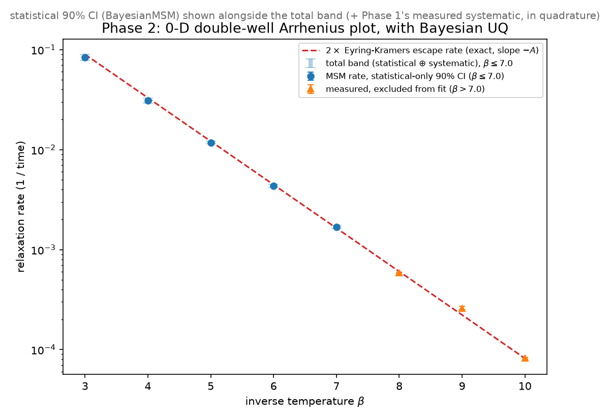
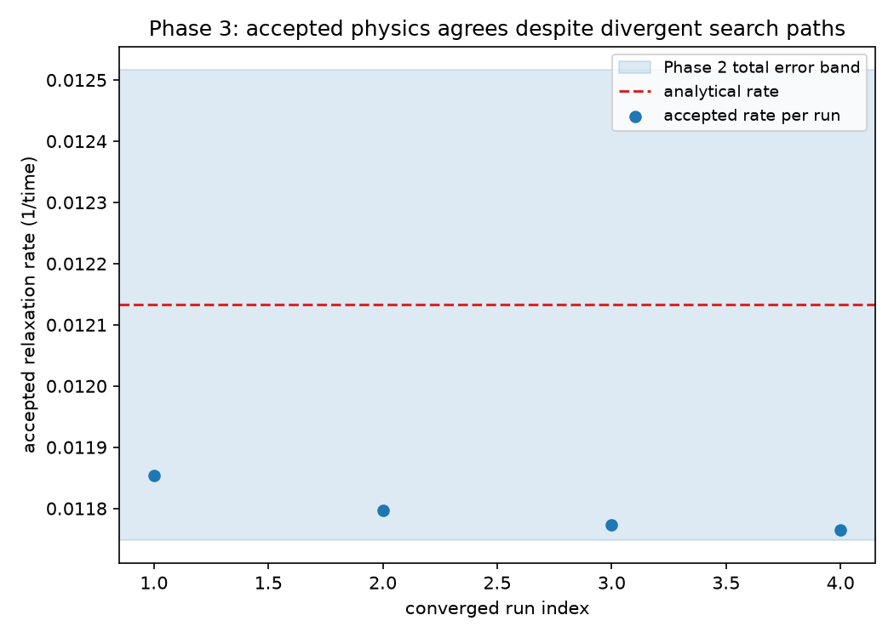

# Moiré-MSM-Engine

**An autonomous multi-agent system that discovers Markov State Model pipelines for stochastic dynamics, verifies every result against exact analytical physics, and quantifies its own uncertainty. Built as a path toward characterizing switching dynamics in moiré (twisted-bilayer) materials.**

## Overview

This project asks the following question: can a multi-agent LLM system be trusted to discover the analysis pipeline for a stochastic dynamical system, when every claim it makes is checked against a known, closed-form physical answer?

The benchmark system used in this project is a stochastic double well, dx = −V'(x)dt + √(2/β)dW — the textbook 1-DOF Kramers problem, chosen deliberately because it is one of the few stochastic systems where both the escape rate (Eyring-Kramers, prefactor included) and the equilibrium population ratio (Boltzmann) are exact and closed-form. A Markov State Model (MSM) pipeline is built on trajectory data from this system; its output is checked against those exact answers, not against another model or a fit. Phase 2 adds an honest statistical + systematic error budget on top of that check. Phase 3 wraps the whole pipeline in a three-agent architecture — Orchestrator / Optimizer / Validator, mirroring the Prover/Verifier separation of [Axiomatic AI's Ax-Prover](https://arxiv.org/abs/2510.12787) (Koppens et al.), where an LLM proposes analysis configurations and a second, independent process grounded in the same closed-form physics decides whether to accept them. The LLM never gets to grade its own work.

The eventual target (Phase 4, not yet attempted) is the same verified pipeline applied to a 2D stochastic Allen-Cahn field at small domain size, with a tilt parameter standing in for the asymmetry between stacking domains in twisted bilayer graphene — the moiré materials that motivate this work.

## Architecture

| Phase | What it does | Status |
|---|---|---|
| **1 — Verified engine** | 0-D stochastic double well; MSM recovers exactly two macrostates; extracted rate matches the exact Eyring-Kramers law (prefactor included) | **Complete** |
| **2 — Uncertainty quantification** | BayesianMSM credible intervals combined with Phase 1's measured systematic bias into an honest total error budget | **Complete** |
| **3 — Agentic loop** | Orchestrator / Optimizer / Validator loop proposes, runs, and verifies analysis configurations autonomously, against the same physics from Phase 1/2 | **Complete, demonstrated with real LLM calls** |
| **4 — 2D deployment** | Same verified pipeline applied to a 2D Allen-Cahn field with a tilt (moiré stand-in); qualitative validation against the Phase 1 reference | Not complete |

The three agents in Phase 3, and how they map onto Ax-Prover:

- **Optimizer** (≙ Prover) — proposes the next analysis configuration (cluster count, MSM lag time). Disciplined by a deterministic tool call, never allowed to predict its own score.
- **Validator** (≙ Verifier) — computes two hard physics checks in plain Python against the closed-form answers *before* any LLM call, then asks an LLM only to interpret an already-decided verdict. The verdict is a property of the schema, not of the LLM's opinion: a `model_validator` recomputes it from the checks on every construction, so an enthusiastic "looks good" from the LLM cannot flip a failing check.
- **Orchestrator** — pure routing. No LLM, no physics judgment: a deterministic function of the Validator's verdict and the iteration count decides whether to continue, accept, or stop at the iteration cap.

## Verified results

### Phase 1 — the physics

Sweeping β = 3–10, the MSM-extracted relaxation rate follows log(rate) vs. β with slope **−0.981** against the exact analytical slope of −1 (**1.87% deviation**), and the equilibrium population ratio matches exp(−βΔF) exactly at the symmetric point. Two real methodological bugs were found and fixed en route (sparse-transition-count bias at high β, and an under-converged MSM lag time) — documented in `PROJECT_STATE.md`.



### Phase 2 — the uncertainty

A first version of the UQ gate checked the analytical rate against a bare Bayesian credible interval and failed at 4 of 5 test points. This is not a bug, but a bare statistical interval failing to account for the real systematic bias Phase 1 had already measured. The fix follows standard experimental practice: report statistical and systematic uncertainty separately, combine them in quadrature, and gate on the total (**≈3.16%** at the reference β). Verified against the real analytical value before being trusted, not assumed to work.

### Phase 3 — the agents search, and the verifier constrains them

An early version of the Optimizer's prompt handed it the converged configuration directly: every one of 8 real runs proposed the identical config on the first try, so the Validator's gate was never tested against a wrong answer. Diagnosed, reported, and fixed: the Optimizer is now given only the search space, not the answer. Four independent real runs (`anthropic:claude-sonnet-5`, real API calls) then showed the property the architecture is actually meant to demonstrate:

- **4/4 runs converged**, taking 4–6 iterations each via different search paths
- **20 real rejections** across those runs, 100% attributable to the physics gate (a biased rate), 0% to ill-posedness. The Validator is discriminating, not rubber-stamping
- **4 different accepted configurations**, all landing inside the same pre-fixed uncertainty band

Different debates, same verification standard, consistent accepted physics. This tells us that the verifier is doing real constraining work, not decorating a foregone conclusion.



Full narrative in `results/phase3_convergence_study_report.md`; every run's ledger is in `results/phase3_convergence_study/`.

## Repository structure

```
physics/       the environment: potential, 0-D/2D integrators, closed-form known answers
pipeline/      the analysis: clustering, MSM construction, Bayesian UQ
agents/        the three-agent loop: schemas, deterministic tool, Optimizer, Validator, Orchestrator
scripts/       phase entry points (run_phase1_benchmark.py, run_phase2_uq.py, run_phase3_agentic.py, ...)
tests/         known-answer tests, one file per module, 99 tests, all passing
results/       generated plots, raw sweep data, agent ledgers
CLAUDE.md          project constitution: engineering discipline and hard boundaries
PROJECT_STATE.md   full session-by-session working log — every decision, bug, and finding
```

## Getting started

```bash
git clone https://github.com/inesalonsoo/multiagent_for2Dphysics.git
cd multiagent_for2Dphysics
python -m venv .venv
source .venv/Scripts/activate      # .venv\Scripts\Activate.ps1 on Windows PowerShell
pip install -r requirements.txt
pytest tests/ -q                   # 99 tests, no API key required
```

Phases 1 and 2 run standalone:

```bash
python -m scripts.run_phase1_benchmark
python -m scripts.run_phase2_uq
```

Phase 3 makes real calls to the Anthropic API — set `ANTHROPIC_API_KEY` in a local `.env` file (never committed; see `.env.example`) before running:

```bash
python -m agents.loop                    # one real agentic-loop run
python -m scripts.run_phase3_agentic     # the full convergence-robustness study
```

All test-suite coverage of the agentic loop uses scripted fake LLMs (`pydantic_ai.models.function.FunctionModel`). Zero real API calls are made by `pytest`.

## Engineering discipline

Every module carries a plain-English docstring, named intermediate variables, and no function longer than ~40 lines. Known-answer checks are treated as law: a failing physics check is stopped and reported, never loosened to force a pass. Every design decision, bug, and honest negative finding is logged in `PROJECT_STATE.md` as it happens, including the times a first attempt was wrong, diagnosed, and fixed in the open rather than overwritten.

## References

- Rolland, Bouchet & Simonnet, *Computing transition rates for the 1-D stochastic Ginzburg–Landau–Allen–Cahn equation*, [arXiv:1507.05577](https://arxiv.org/abs/1507.05577) — the 0-D/2D physics ground truth this project builds on.
- Axiomatic AI (Koppens et al.), *Ax-Prover*, [arXiv:2510.12787](https://arxiv.org/abs/2510.12787) — the Orchestrator/Prover/Verifier architecture Phase 3's agent design mirrors.
