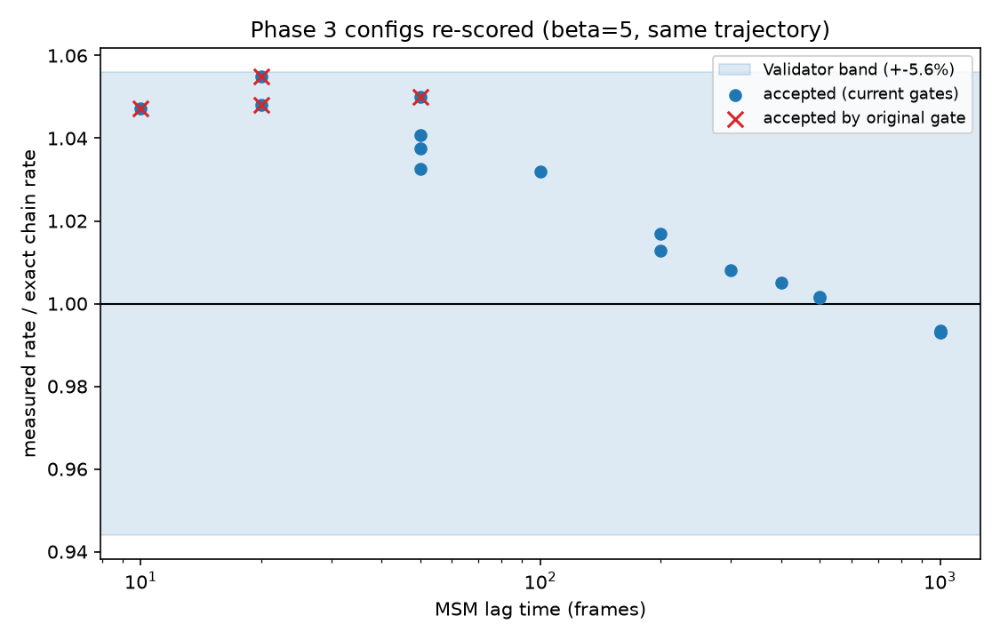

# Moiré-MSM-Engine

Can an AI agent be trusted to set up a scientific analysis? This project
tests that on a problem whose answer is known exactly, so every result can
be checked.

## The idea in one minute

Picture a ball in a landscape with two valleys, constantly shaken by heat.
Most of the time it rattles around inside one valley; now and then a strong
kick carries it over the hill into the other. How often that happens (the
**hopping rate**) is a basic question about many physical systems, from
molecules to magnetic materials.

We simulate this "double well" and analyze the simulated path with a
**Markov State Model (MSM)**: the path is cut into small regions, and the
MSM records how often the ball moves from one region to another. From that
map it estimates how fast the system relaxes between the valleys, which is
set by the hopping rate.

For this landscape the true answer can be computed exactly, without any
simulation. So we can check the analysis against the truth, not against
another model.

On top of that, the analysis is run by three agents: an AI proposes the
settings, ordinary code checks the physics (a second AI only comments on
the result), and a fixed rule decides when to stop. A separate part of the
project states facts about the landscape in the **Lean** proof assistant,
2 of 7 of them proved so far.

## What we check against

The model is the overdamped double well dx = −V′(x)dt + √(2/β)dW with
V(x) = A(x² − 1)², where β measures how cold the system is (higher β means
rarer hops). The exact references (`physics/known_answers.py`):

- **The relaxation rate λ₂**: how fast the system forgets which valley it
  started in, which is what an MSM measures. For two equal valleys it is
  twice the hopping rate. Computed from the governing equation on a fine
  grid.
- **The simulated version of that rate**: the simulation moves in small
  time steps, which speeds it up slightly (1.2% at our step size); we
  compute that exactly too.
- **How the time is shared between the valleys**: exactly 50/50 for the
  symmetric landscape (a reference value; it is not used as a pass/fail
  check).

The textbook Eyring-Kramers formula only becomes exact for very cold
systems. At the temperatures used here it overestimates the rate by 7-11%,
so it is shown only for comparison.

## Results

| Phase | Question | Answer |
|---|---|---|
| 1. The physics | Does the MSM recover the true rate? | Consistent with it at every temperature the data can resolve (β = 3-9) |
| 2. Error bars | Are the MSM's built-in (Bayesian) error bars honest? | No: they are far too narrow (an honest negative result) |
| 3. AI agents | Can agents run the analysis under a strict physics check? | The checking machinery works; its rate check is too loose to catch a 5% bias |
| 3.5. Formal proofs | Can facts about the landscape be proved in Lean? | 2 of 7 statements proved so far |
| 4. 2D extension | Same analysis on a 2D field | Not started; parameters being re-chosen |

### Phase 1: the physics

For each temperature we run 6 independent simulations. In each, the MSM's
**lag time** (how far apart in time it looks when counting moves) is set
to a tenth of the slowest timescale it finds, and two sanity checks must
pass: the model predicts its own longer-lag behavior (a Chapman-Kolmogorov
test), and exactly one slow process exists (two valleys, not one). For
β = 3-9 the measured rate is consistent with the exact one (no difference
at the 1% significance level). The precision is 1-3% at β = 3-5 and loosens
to tens of percent at β = 8-9, where hops are rare. At β = 10 the
simulation sees too few hops to measure, and we say so.


### Phase 2: the error bars

The MSM software can also report Bayesian error bars. Here they are 11-193
times narrower than the actual spread between independent simulations, and
contain the exact answer in only 2 of 42 cases. The reason: the software
treats millions of overlapping, strongly correlated observations as if
they were nearly independent. We use the spread between simulations as our
error bars instead.

### Phase 3: the AI agents

The design follows [Ax-Prover](https://arxiv.org/abs/2510.12787), which
separates the agent that proposes from the one that verifies:

- The **Optimizer** (an AI) proposes settings: the number of regions and
  the lag time.
- The **Orchestrator** (plain code) runs the analysis on each proposal,
  passes the result on, and decides when to stop.
- The **Validator** checks the physics in ordinary code before any AI is
  asked: one slow process, and a rate within ±5.6% of the exact value.
  That band is three times the spread of 6 simulations at this temperature;
  the trend over all temperatures suggests the true spread is larger (about
  3.4%, so a band near ±10%). Its AI only comments; it cannot overturn a
  check.

An earlier study (4 runs, 20 proposals) used the Eyring-Kramers formula as
its reference. Re-checked against the exact rate, without any new AI calls,
all 17 distinct settings pass. Within that one simulation the measured rate
clearly falls toward the exact value as the lag time grows, but short lag
times sit up to 5.5% high, still inside the ±5.6% band. The original check
had accepted only those short-lag settings and rejected the accurate ones.
The next step is for the Validator to also require a converged lag (at
least a tenth of the slowest timescale, as Phase 1 does).



### Phase 3.5: the formal proofs

[`lean/Oracle/Potential.lean`](lean/Oracle/Potential.lean) states 7 facts
about the landscape: the formula for its slope, its curvature at the
valleys and the hilltop, where the valleys are, how high the hill is, and
its left-right symmetry. Lean only accepts a proof if every step is
correct; an unproved statement certifies nothing yet.

- Proved: the left-right symmetry (by
  [ax-prover](https://arxiv.org/abs/2602.24273)) and the slope formula used
  by the simulation (by Lemma, another proof tool). Lean confirms neither
  relies on an unproved placeholder
  ([check log](results/lean_v_hasDerivAt_check.log)).
- The statements are written first and never edited by the prover.
- The curvature and barrier facts back the Eyring-Kramers comparison; the
  exact rates themselves are computed numerically, outside Lean.
- Setup: Lean v4.33.0-rc1, Mathlib locked at `9d302fc`. Build with
  `cd lean && lake exe cache get && lake build`.

## Known limitations

- The MSM's Bayesian error bars are overconfident here (Phase 2).
- The agents' rate check is too loose to catch a ~5% bias, and its width
  rests on only 6 simulations (Phase 3).
- The MSM assumes the dynamics are reversible in time (detailed balance)
  rather than testing it.
- Phase 1 takes about 5 hours, mostly for the Bayesian error bars.
- In 2D, the energy barrier grows with the system's area, so the planned
  2D parameters are being re-chosen.

## Repository structure

```
physics/      the landscape, the simulations, the exact answers
pipeline/     the analysis: regions, MSM, error bars
agents/       the three agents and their analysis tool
lean/         the formal proofs
scripts/      one entry point per phase
tests/        automated checks, one file per module
results/      figures, data, agent logs, Lean check log
presentation/ slide deck
docs/         full project history
archive/      superseded material, kept for the record
```

`CLAUDE.md` holds the project's working rules; `PROJECT_STATE.md` its
current state.

## Running it

```bash
git clone https://github.com/inesalonsoo/multiagent_for2Dphysics.git
cd multiagent_for2Dphysics
python -m venv .venv
source .venv/Scripts/activate      # .venv\Scripts\Activate.ps1 in PowerShell
pip install -r requirements.txt
pytest tests/ -q                   # 112 tests; no API key needed
```

```bash
python -m scripts.run_phase1_benchmark    # about 5 hours
python -m scripts.run_phase2_uq           # seconds, uses Phase 1's results
python -m scripts.rescore_phase3_ledgers  # about 10 minutes, no AI calls
```

The agents call the Anthropic API. Set the key as an environment variable
first (`export ANTHROPIC_API_KEY=...`, or `$env:ANTHROPIC_API_KEY="..."` in
PowerShell), then run `python -m agents.loop`. The tests use scripted fake
agents and make no API calls.

## Where moiré materials fit

Moiré materials (stacked, slightly twisted atomic layers) are the
motivation: they switch between competing arrangements, and measuring such
switching reliably matters. This project is not a model of them; real moiré
domains are far more complex than a double well. It develops a checkable
method on a problem with a known answer.

## References

- Rolland, Bouchet & Simonnet, *Computing transition rates for the 1-D
  stochastic Ginzburg-Landau-Allen-Cahn equation…*,
  [arXiv:1507.05577](https://arxiv.org/abs/1507.05577): reference for the
  field version (Phase 4).
- Breen et al., *Ax-Prover: A Deep Reasoning Agentic Framework for Theorem
  Proving in Mathematics and Quantum Physics*,
  [arXiv:2510.12787](https://arxiv.org/abs/2510.12787): the agent design.
- Requena et al., *A Minimal Agent for Automated Theorem Proving*,
  [arXiv:2602.24273](https://arxiv.org/abs/2602.24273): the `ax-prover` tool.
