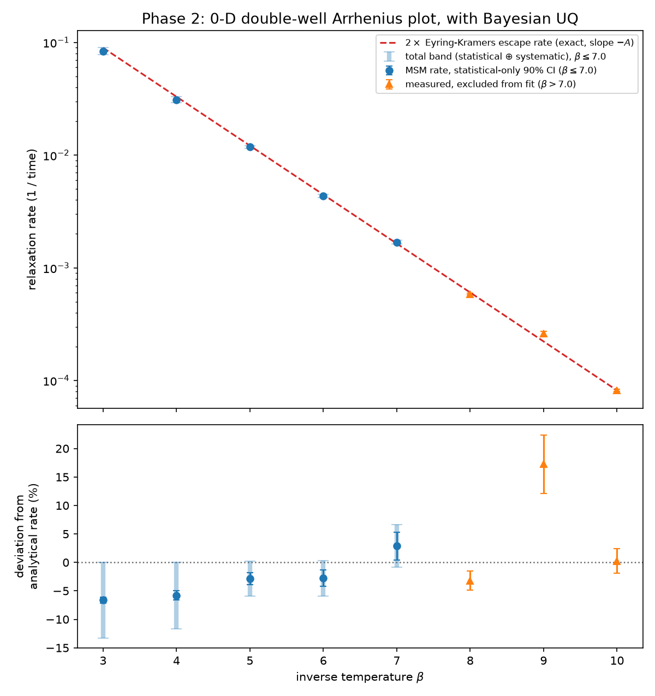
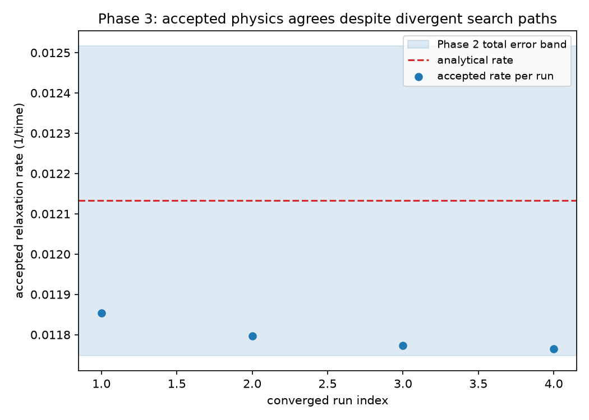

# Moiré-MSM-Engine

**An autonomous multi-agent system that discovers Markov State Model pipelines for stochastic dynamics, verifies every result against exact analytical physics, and quantifies its own uncertainty. Demonstrated on a textbook double-well benchmark, motivated by — but not a physical model of — switching dynamics in moiré (twisted-bilayer) materials (see "Where moiré materials fit" below).**

## Overview

This project asks the following question: can a multi-agent LLM system be trusted to discover the analysis pipeline for a stochastic dynamical system, when every claim it makes is checked against a known, closed-form physical answer?

The benchmark system used in this project is a stochastic double well, dx = −V'(x)dt + √(2/β)dW — the textbook 1-DOF Kramers problem, chosen deliberately because it is one of the few stochastic systems where both sides of the check are closed-form: the Eyring-Kramers escape rate's exponent is exact and its prefactor is asymptotically exact (exact as β→∞, matching this project's own measured rate to a few percent within its gated β≤7 range — see `physics/known_answers.py`), and the equilibrium population ratio (Boltzmann) is exact by symmetry. A Markov State Model (MSM) pipeline is built on trajectory data from this system; its output is checked against those exact answers, not against another model or a fit. Phase 2 adds an honest statistical + systematic error budget on top of that check. Phase 3 wraps the whole pipeline in a three-agent architecture — Orchestrator / Optimizer / Validator, mirroring the Prover/Verifier separation of [Axiomatic AI's Ax-Prover](https://arxiv.org/abs/2510.12787) (Breen et al.), where an LLM proposes analysis configurations and a second, independent process grounded in the same closed-form physics decides whether to accept them. The LLM never gets to grade its own work.

### Where moiré materials fit — motivation, not derivation

Phase 4 (not yet attempted) applies the same verified pipeline to a 2D stochastic Allen-Cahn field — still a scalar double-well system, now spatially extended — with a tilt parameter breaking its symmetry the same way Phase 1's `b` does, as a qualitative stress test of the methodology at higher dimensionality.

**This is explicitly not a model of real moiré domain-wall physics.** Twisted-bilayer-graphene stacking domains are governed by a 2-component displacement field on a landscape with three-fold (AA/AB/BA) symmetry set by the generalized stacking-fault energy — not a scalar double well — and domain-wall relaxation there is an elastic soliton-network problem, not single-particle thermal hopping between two Boltzmann-weighted minima. Nothing in this project's model is derived from moiré elasticity; the tilt parameter is a reasonable toy stand-in for breaking a symmetry, no more.

The actual connection is motivation, not derivation: moiré materials are a real system where verified, uncertainty-quantified switching-rate extraction would matter. This project demonstrates that methodology on a textbook benchmark chosen because its ground truth is *exactly known*, not because it resembles the target system's microscopic physics. Building a model that actually derives from moiré elasticity would be a distinct, substantially larger undertaking than what's demonstrated here.

## Architecture

| Phase | What it does | Status |
|---|---|---|
| **1 - Verified engine** | 0-D stochastic double well; MSM recovers exactly two macrostates; extracted rate matches the Eyring-Kramers law (exponent exact, prefactor asymptotically exact) to a few percent | **Complete** |
| **2 - Uncertainty quantification** | BayesianMSM credible intervals combined with Phase 1's measured systematic bias into an honest total error budget | **Complete** |
| **3 - Agentic loop** | Orchestrator / Optimizer / Validator loop proposes, runs, and verifies analysis configurations autonomously, against the same physics from Phase 1/2 | **Complete, demonstrated with real LLM calls** |
| **4 - 2D deployment** | Same verified pipeline applied to a 2D Allen-Cahn field with a symmetry-breaking tilt (a toy stand-in, not a moiré-elasticity model — see above); qualitative validation against the Phase 1 reference | Not complete |

The three agents in Phase 3, and how they map onto Ax-Prover:

- **Optimizer** (≙ Prover) — proposes the next analysis configuration (cluster count, MSM lag time). Disciplined by a deterministic tool call, never allowed to predict its own score.
- **Validator** (≙ Verifier) — computes two hard physics checks in plain Python against the closed-form answers *before* any LLM call, then asks an LLM only to interpret an already-decided verdict. The verdict is a property of the schema, not of the LLM's opinion: a `model_validator` recomputes it from the checks on every construction, so an enthusiastic "looks good" from the LLM cannot flip a failing check. One qualification: the physics *check* (Kramers rate, Boltzmann ratio) is an independent, closed-form oracle, but its *tolerance width* is not an independently chosen precision — `rate_matches_analytical`'s acceptance band (`agents/validator.py::load_rate_tolerance`) reuses Phase 1's own measured total statistical+systematic deviation as the band width, so the gate is set at the precision this project has already demonstrated it can measure, not an independent a-priori target.
- **Orchestrator** — pure routing. No LLM, no physics judgment: a deterministic function of the Validator's verdict and the iteration count decides whether to continue, accept, or stop at the iteration cap.

## Verified results

### Phase 1 — the physics

Sweeping β = 3–10, the MSM-extracted relaxation rate follows log(rate) vs. β with slope **−0.981** against the exact analytical slope of −1 (**1.87% deviation**), and the equilibrium population ratio matches exp(−βΔF) exactly at the symmetric point. Two real methodological bugs were found and fixed en route (sparse-transition-count bias at high β, and an under-converged MSM lag time) — documented in `PROJECT_STATE.md`.

The top panel below is the classic log-rate view; on a 3-decade log scale, the 1–9% statistical/systematic deviations Phase 2 actually quantifies are visually invisible — the bottom panel plots that deviation directly, on a linear scale, which is the panel that actually carries Phase 2's error-budget result.



### Phase 2 — the uncertainty

A first version of the UQ gate checked the analytical rate against a bare Bayesian credible interval and failed at 4 of 5 test points. This is not a bug, but a bare statistical interval failing to account for the real systematic bias Phase 1 had already measured. The fix follows standard experimental practice: report statistical and systematic uncertainty separately, combine them in quadrature (**≈3.16%** at the reference β), and check the total against the analytical rate. That check was itself genuinely falsifiable at first (it failed twice on real data as the band-centering was debugged), but the fix for those failures — centering the band and the systematic term on the same reference mean — turned out to make containment of the analytical value algebraically guaranteed, not a fact about the data. Found and fixed: the analytical-value check is now a reported consistency check on the arithmetic, not a gate, and a genuinely falsifiable gate replaced it — a held-out split of Phase 1's replicas, testing whether one half's mean falls inside a band built entirely from the other half. Full derivation and fix in `PROJECT_STATE.md`.

### Phase 3 — the agents search, and the verifier constrains them

An early version of the Optimizer's prompt handed it the converged configuration directly: every one of 8 real runs proposed the identical config on the first try, so the Validator's gate was never tested against a wrong answer. Diagnosed, reported, and fixed: the Optimizer is now given only the search space, not the answer. Four independent real runs (`anthropic:claude-sonnet-5`, real API calls) then showed the property the architecture is actually meant to demonstrate:

- **4/4 runs converged**, taking 4–6 iterations each; search paths share early prefixes and then diverge (runs 2 and 3 propose byte-identical first two configs; runs 1 and 4 share their first) — 3 distinct openers, 4 distinct endpoints
- **16 of 20 proposed configs were genuinely rejected**, 100% attributable to the physics gate (a biased rate), 0% to ill-posedness. The Validator is discriminating, not rubber-stamping
- The 4 accepted configs are 4 genuinely different `(n_clusters, lag)` pairs, reached via different post-divergence paths, whose measured rates agree with the analytical prediction and with each other to within Phase 2's error band — landing inside the band is true *by construction* here (`rate_matches_analytical` in-band-ness is the Validator's sole binding accept criterion in this study, since `two_states_recovered` was True and `is_ill_posed` False in all 20/20 iterations); the non-trivial part is that 4 independently-searched configs converge on mutually consistent physics while 16 others are correctly turned away

Different debates, same verification standard, consistent accepted physics. This tells us that the verifier is doing real constraining work by rejecting wrong configs — not that landing "inside the band" is itself a discovery.



**One asymmetry worth stating explicitly**: in these 4 runs, every rejection and every accepted rate happened to sit on the same side of the analytical value (measured low) — the plot above shows it directly. That's a real, one-sided gap in what this particular batch demonstrates about the Validator, not a bug. It was checked directly against the real pipeline (no LLM call needed): a lag time short enough to sit below the system's mixing time gives a real, well-posed config that *overestimates* the rate by as much as 82%, and the Validator's actual check function rejects it — confirming the gate is symmetric, from real data rather than assumption. Full investigation in `results/phase3_convergence_study_report.md`; locked in as a permanent test in `tests/test_tools.py`.

Full narrative in `results/phase3_convergence_study_report.md`; every run's ledger is in `results/phase3_convergence_study/`.

## Repository structure

```
physics/       the environment: potential, 0-D/2D integrators, closed-form known answers
pipeline/      the analysis: clustering, MSM construction, Bayesian UQ
agents/        the three-agent loop: schemas, deterministic tool, Optimizer, Validator, Orchestrator
scripts/       phase entry points (run_phase1_benchmark.py, run_phase2_uq.py, run_phase3_agentic.py, ...)
tests/         known-answer tests, one file per module, 102 passed / 3 skipped (Lean Group B, pending a real ax-prover run; plus the new held-out UQ gate, pending a cache regeneration — see PROJECT_STATE.md's 2026-08-03 entry)
results/       generated plots, raw sweep data, agent ledgers
archive/       superseded artifacts (pre-pivot dead ends, an old study run) — not part of the current pipeline, kept for the record
CLAUDE.md          project constitution: engineering discipline and hard boundaries
PROJECT_STATE.md   full session-by-session working log — every decision, bug, and finding
```

## Getting started

```bash
git clone https://github.com/inesalonsoo/multiagent_for2Dphysics.git
cd multiagent_for2Dphysics
python -m venv .venv
source .venv/Scripts/activate      # .venv\Scripts\Activate.ps1 on Windows PowerShell
pip install -r requirements.txt
pytest tests/ -q                   # 102 passed, 3 skipped (Lean Group B + the new held-out UQ gate,
                                    # pending a cache regeneration -- see PROJECT_STATE.md), no API key required
```

Phases 1 and 2 run standalone:

```bash
python -m scripts.run_phase1_benchmark
python -m scripts.run_phase2_uq
```

Phase 3 makes real calls to the Anthropic API — set `ANTHROPIC_API_KEY` in a local `.env` file (never committed; see `.env.example`) before running:

```bash
python -m agents.loop                    # one real agentic-loop run
python -m scripts.run_phase3_agentic     # the full convergence-robustness study
```

All test-suite coverage of the agentic loop uses scripted fake LLMs (`pydantic_ai.models.function.FunctionModel`). Zero real API calls are made by `pytest`.

## Engineering discipline

Every module carries a plain-English docstring, named intermediate variables, and no function longer than ~40 lines. Known-answer checks are treated as law: a failing physics check is stopped and reported, never loosened to force a pass. Every design decision, bug, and honest negative finding is logged in `PROJECT_STATE.md` as it happens, including the times a first attempt was wrong, diagnosed, and fixed in the open rather than overwritten.

## References

- Rolland, Bouchet & Simonnet, *Computing transition rates for the 1-D stochastic Ginzburg–Landau–Allen–Cahn equation*, [arXiv:1507.05577](https://arxiv.org/abs/1507.05577) — the 0-D/2D physics ground truth this project builds on.
- Axiomatic AI (Breen et al.), *Ax-Prover*, [arXiv:2510.12787](https://arxiv.org/abs/2510.12787) — the Orchestrator/Prover/Verifier architecture Phase 3's agent design mirrors.
